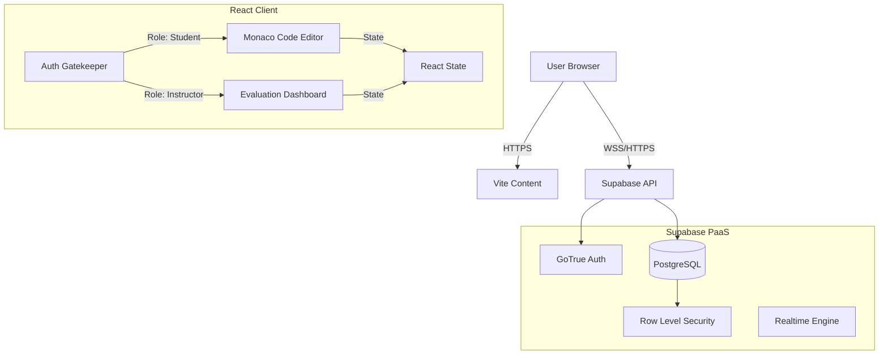

# CodeIR: Intermediate Representation Visualization Platform

## Overview

**CodeIR** is a full-stack educational web application designed to bridge the gap between high-level source code and compiler Intermediate Representations (IR). It features a sophisticated dual-role architecture (Student/Instructor) enabling real-time code submission, IR visualization, and rubric-based evaluation.

The system leverages a **Serverless Architecture** via Supabase, employing strictly typed **TypeScript** interfaces on the frontend to ensure type safety across the full stack.

---

## System Architecture

The application follows a **Single Page Application (SPA)** architecture served via Vite, utilizing a "Gatekeeper" pattern for authentication state management.



### Key Technical Decisions

1. **Monaco Editor Integration:** Utilizes `@monaco-editor/react` to provide VS Code-level editing capabilities (IntelliSense, syntax highlighting) directly in the browser.
2. **Tailwind CSS v4:** Adopts the latest CSS-first configuration approach for high-performance atomic styling, utilizing `dvh` units for robust mobile responsiveness.
3. **Supabase Auth & RLS:** Authentication is decoupled from application logic. Data security is enforced at the database engine level via PostgreSQL Row Level Security (RLS) policies.

---

## Tech Stack

### Frontend Core

* **Framework:** React 18 (Functional Components, Hooks)
* **Language:** TypeScript (Strict Mode)
* **Build Tool:** Vite (ESBuild based)
* **Styling:** Tailwind CSS v4, Lucide React (Iconography)

### Editor & Visualization

* **Editor Engine:** Monaco Editor (VS Code core)
* **State Management:** React Context API + Local State (optimized to prevent prop drilling)

### Backend & Database

* **BaaS:** Supabase
* **Database:** PostgreSQL 15+
* **Auth:** Supabase Auth (JWT based)
* **API:** PostgREST (Auto-generated REST API from Schema)

---

## Database Schema

The data layer consists of relational tables with strict Foreign Key constraints and cascading deletion policies.

### 1. `public.submissions`

Stores student code attempts.

| Column | Type | Constraints | Description |
| --- | --- | --- | --- |
| `id` | `uuid` | `PK`, `DEFAULT gen_random_uuid()` | Unique Submission ID |
| `user_id` | `uuid` | `FK -> auth.users.id`, `NOT NULL` | The student author |
| `source_code` | `text` |  | Raw source code content |
| `description` | `text` |  | Student's problem statement |
| `language` | `text` | `DEFAULT 'javascript'` | Target language |
| `ir_output` | `text` |  | Generated Intermediate Representation |
| `status` | `text` | `DEFAULT 'draft'` | Workflow status |
| `created_at` | `timestamptz` | `DEFAULT now()` | Timestamp |

### 2. `public.evaluations`

Stores instructor feedback and rubric scores.

| Column | Type | Constraints | Description |
| --- | --- | --- | --- |
| `id` | `uuid` | `PK`, `DEFAULT gen_random_uuid()` | Unique Evaluation ID |
| `submission_id` | `uuid` | `FK -> submissions.id`, `UNIQUE` | 1:1 Link to submission |
| `instructor_id` | `uuid` | `FK -> auth.users.id` | The evaluator |
| `rubric_scores` | `jsonb` | `DEFAULT '{}'` | Structured scoring (JSONB for flexibility) |
| `feedback` | `text` |  | Qualitative feedback |

---

## Security & RLS Policies

Security is enforced at the Postgres level.

**1. Submission Isolation:**

```sql
CREATE POLICY "Users can see own submissions" 
ON submissions FOR SELECT 
USING (auth.uid() = user_id);

```

**2. Data Integrity:**

* `ON DELETE CASCADE` is implemented on `submissions`. If a user is deleted, their code attempts vanish.
* `ON DELETE CASCADE` is implemented on `evaluations`. If a submission is deleted, its grade vanishes.

---

## Project Structure

```text
codeir/
├── src/
│   ├── assets/             # Static assets
│   ├── components/
│   │   ├── AuthForm.tsx    # Login/Signup with Toggle Logic
│   │   ├── CodeEditor.tsx  # Student View (Monaco + IR Split)
│   │   └── InstructorEvaluation.tsx # Instructor View (3-Column Layout)
│   ├── lib/
│   │   └── supabaseClient.ts # Singleton Supabase Client
│   ├── App.tsx             # Main Router / Auth Gatekeeper
│   ├── index.css           # Tailwind v4 Imports & Base styles
│   └── main.tsx            # Entry Point
├── .gitignore              # Security & Build exclusions
├── index.html              # HTML Root
├── package.json            # Dependencies & Scripts
├── tsconfig.json           # TypeScript Configuration
└── vite.config.ts          # Vite Configuration

```

---

## Installation & Setup

### Prerequisites

* Node.js v16+
* npm or yarn
* A Supabase Project

### Step 1: Clone & Install

```bash
git clone [https://github.com/your-username/codeir.git](https://github.com/your-username/codeir.git)
cd codeir
npm install

```

### Step 2: Environment Configuration

Create a `.env` file in the root directory:

```env
VITE_SUPABASE_URL=your_supabase_project_url
VITE_SUPABASE_ANON_KEY=your_supabase_anon_key

```

### Step 3: Database Migration

Execute the following SQL in your Supabase SQL Editor to initialize the schema:

```sql
-- Enable UUID extension
create extension if not exists "uuid-ossp";

-- Create Tables
create table submissions (
  id uuid default gen_random_uuid() primary key,
  created_at timestamp with time zone default timezone('utc'::text, now()) not null,
  user_id uuid references auth.users not null,
  source_code text,
  description text,
  language text default 'javascript',
  ir_output text,
  status text default 'draft'
);

create table evaluations (
  id uuid default gen_random_uuid() primary key,
  created_at timestamp with time zone default timezone('utc'::text, now()) not null,
  submission_id uuid references submissions(id) on delete cascade not null,
  instructor_id uuid references auth.users(id) not null,
  rubric_scores jsonb default '{}'::jsonb,
  feedback text,
  constraint evaluations_submission_id_key unique (submission_id)
);

-- Enable RLS
alter table submissions enable row level security;
alter table evaluations enable row level security;

-- Add Policies (Dev/Demo Mode)
create policy "Public access for demo" on submissions for all using (true);
create policy "Public access for demo" on evaluations for all using (true);

```

### Step 4: Run Development Server

```bash
npm run dev

```

---

## Features Breakdown

### Role-Based Access Control (RBAC)

The application determines the UI to render based on user metadata:

* **Student:** Accesses `CodeEditor.tsx`. Can write code, view mock IR generation, and submit.
* **Instructor:** Accesses `InstructorEvaluation.tsx`. Can view student code (read-only/writeable depending on mode), view IR, and input rubric scores/feedback.

### Sandbox Mode

If the Instructor view is loaded without a database connection or valid student submission, the system gracefully degrades into **Sandbox Mode**.

* **Behavior:** The editor becomes writable for manual testing.
* **Visual Cue:** A yellow "Sandbox Mode" badge appears in the header.
* **Submission:** Saving is disabled/mocked to prevent foreign key constraint violations.

---

## License

Distributed under the MIT License.

**Academic Use Only** | CodeIR Architecture Team

```

```
