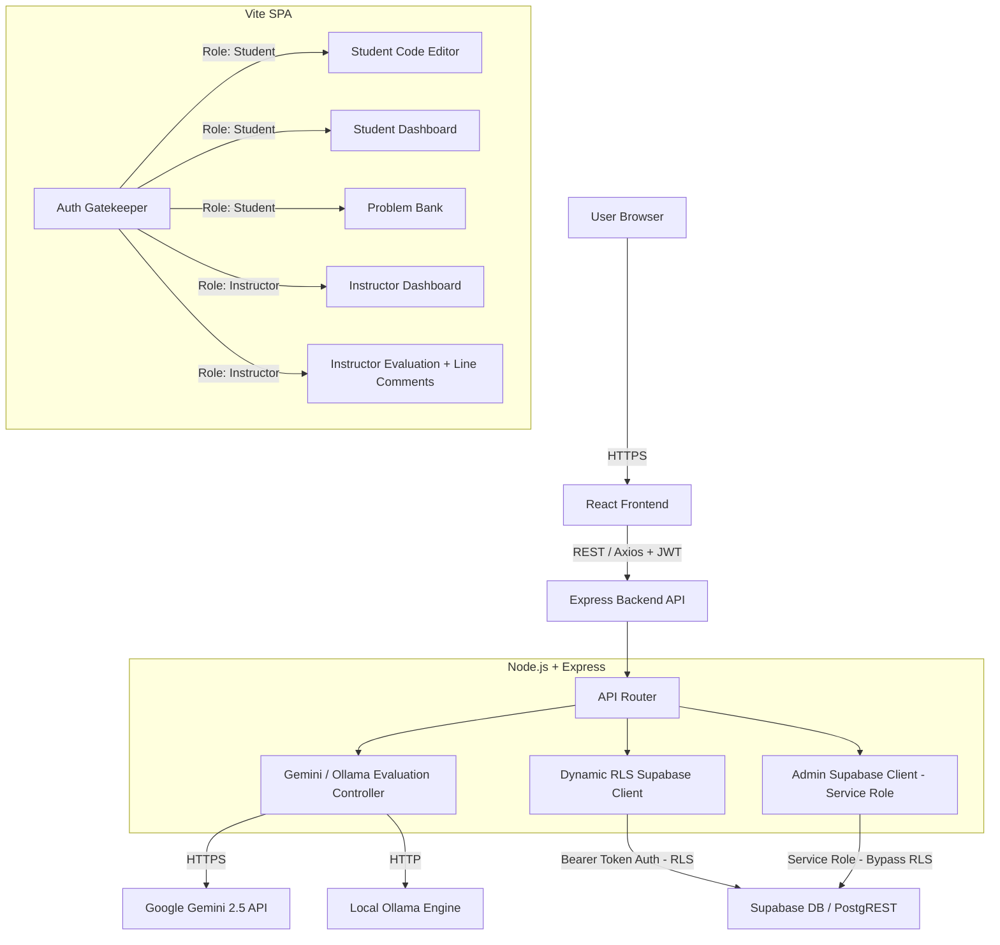

# CodeIR: Intermediate Representation Visualization Platform

## Overview

**CodeIR** is a full-stack educational web application designed to bridge the gap between high-level source code and compiler Intermediate Representations (IR). It features a sophisticated dual-role architecture (Student/Instructor) enabling real-time code submission, AI-powered code evaluation, IR visualization, rubric-based assessment, user profile management, and granular per-line code review comments.

The system leverages a **Serverless Database Architecture** via Supabase alongside a **Dual AI Engine Architecture** (Google Gemini 2.5 Flash for cloud, and Ollama for secure local CPU inference). It strictly employs typed **TypeScript** interfaces on the frontend to ensure type safety across the full stack while utilizing delegated Row Level Security (RLS) for comprehensive data protection.

---

## System Architecture

The application operates on a **Full-Stack API Gateway Architecture**. The React frontend communicates strictly with a Node.js/Express backend, which securely manages interactions with Supabase and Google's Generative AI API.


```mermaid
graph TD
    User[User Browser] -->|HTTPS| React[React Frontend]

    subgraph Frontend [Vite SPA]
        Auth[Auth Gatekeeper]
        Auth -->|Role: Student| Editor[Student Code Editor]
        Auth -->|Role: Student| Dash[Student Dashboard]
        Auth -->|Role: Student| Problems[Problem Bank]
        Auth -->|Role: Instructor| IDash[Instructor Dashboard]
        Auth -->|Role: Instructor| Eval[Instructor Evaluation + Line Comments]
    end

    React -->|REST / Axios + JWT| API[Express Backend API]

    subgraph Backend [Node.js + Express]
        Router[API Router]
        EvalController[Gemini / Ollama Evaluation Controller]
        DBController[Dynamic RLS Supabase Client]
        AdminClient[Admin Supabase Client - Service Role]
    end

    API --> Router
    Router --> EvalController
    Router --> DBController
    Router --> AdminClient

    EvalController -->|HTTPS| Gemini[Google Gemini 2.5 API]
    EvalController -->|HTTP| Ollama[Local Ollama Engine]
    DBController -->|Bearer Token Auth - RLS| SB[Supabase DB / PostgREST]
    AdminClient -->|Service Role - Bypass RLS| SB
```

### Key Technical Decisions

1. **Monaco Editor Integration:** Utilizes `@monaco-editor/react` to provide VS Code-level editing capabilities (IntelliSense, syntax highlighting) directly in the browser.
2. **Dedicated Node.js Backend:** Centralizes API logic, protecting the Gemini AI pipeline and enforcing sequential relational database updates without exposing sensitive Supabase credentials to the client.
3. **Dual AI Evaluation Pipeline (Gemini/Ollama):** Integrates with `@google/generative-ai` (Gemini 2.5 Flash) and local `Ollama` models via the backend API to evaluate code correctness, generate pseudocode (IR), and produce cross-language translations (Python, Java, C++).
4. **Dual Supabase Client Strategy:** The backend maintains two Supabase clients — an **admin client** (service role key, bypasses RLS) for system-level operations like sandbox problem creation, and an **auth-delegated client** (user JWT) for student-owned data ensuring RLS is enforced per-user.
5. **Tailwind CSS v4:** Adopts the latest CSS-first configuration approach for high-performance atomic styling, utilizing `dvh` units for robust mobile responsiveness.
6. **Relational Data Mapping:** Highly normalized PostgreSQL structure (`problems`, `submissions`, `pseudocodes`, `evaluations`, `review_comments`) with strict foreign keys to preserve learning traces and auditability.
7. **Granular Code Review Comments:** Per-line CRUD feedback system using `review_comments` table; instructors annotate specific lines with typed badges and students see corrections tied directly to their code.
8. **DB-Persisted User Profiles:** Display name, bio, avatar, and theme preference are stored directly in `auth.users.user_metadata` via the Supabase Admin Auth API, persisting across all devices without an extra table.

---

## Tech Stack

### Frontend Core

- **Framework:** React 18 (Functional Components, Hooks)
- **Language:** TypeScript (Strict Mode)
- **Build Tool:** Vite (ESBuild based)
- **Styling:** Tailwind CSS v4, Lucide React (Iconography)
- **Resizable Panels:** `react-resizable-panels`

### Editor & Visualization

- **Editor Engine:** Monaco Editor (VS Code core)
- **State Management:** React Local State + `Promise.allSettled` for resilient parallel data fetching

### Backend & API Middleware

- **Runtime:** Node.js
- **Server Framework:** Express.js
- **Middleware:** CORS, dotenv
- **Client Networking:** Axios (Frontend ↔ Backend)

### Database Layer (BaaS)

- **Platform:** Supabase
- **Database:** PostgreSQL 15+
- **Auth:** Supabase Auth (JWT via Frontend) + Admin Auth API (user_metadata CRUD)
- **Data Access:** Dynamic Auth Delegation (user JWT for RLS) + Service Role (admin operations)

### AI & Evaluation Engine

- **LLM Manager:** Google Gemini 2.5 Flash (Cloud API) & Local Ollama Engine (`gpt-oss:latest`)
- **Features:** Toggleable AI engine, code correctness validation, high-level IR generation, cross-language translation.

---

## Relational Database Schema

The data layer is a highly normalized relational model with strict Foreign Key constraints and sequential dependency requirements.

### 1. `auth.users` (Supabase Auth — user_metadata)
Stores profile fields directly in Supabase Auth user metadata. No extra table needed.
- `user_metadata.display_name` (Text)
- `user_metadata.bio` (Text)
- `user_metadata.theme_preference` (Text) — `'dark'` | `'light'`
- `user_metadata.avatar_url` (Text)

### 2. `public.problems`
The unit of practice, managed by instructors; sandbox submissions create placeholder rows.
- `problem_id` (UUID, PK)
- `title` (Text)
- `problem_statement` (Text)
- `boilerplate_code` (Text)
- `difficulty_level` (Text) — `'Easy'` | `'Medium'` | `'Hard'`

### 3. `public.submissions`
Append-only history of student attempts (drafts + valid submissions).
- `submission_id` (UUID, PK)
- `user_id` (UUID, FK → auth.users)
- `problem_id` (UUID, FK → problems)
- `source_language` (Text)
- `source_code` (Text)
- `validation_status` (Text Check: `'pending'` | `'draft'` | `'invalid'` | `'valid'`)
- `submission_timestamp` (Timestamptz)

### 4. `public.pseudocodes`
Strict 1-to-1 mapping of AI-generated IR to a valid submission.
- `pseudocode_id` (UUID, PK)
- `submission_id` (UUID, UNIQUE FK → submissions)
- `structured_blocks` (JSONB)
- `locked_status` (Boolean)

### 5. `public.translations`
Target language outputs from a validated pseudocode block.
- `translation_id` (UUID, PK)
- `pseudocode_id` (UUID, FK → pseudocodes)
- `target_language` (Text)
- `translated_code` (Text)

### 6. `public.evaluations`
Instructor rubric assessment tied to a submission.
- `evaluation_id` (UUID, PK)
- `submission_id` (UUID, FK → submissions)
- `final_scores` (JSONB) — `{ correctness, efficiency, style }`
- `teacher_feedback` (Text)

### 7. `public.review_comments` *(New)*
Granular per-line code review annotations by instructors.
- `comment_id` (UUID, PK)
- `submission_id` (UUID, FK → submissions, ON DELETE CASCADE)
- `instructor_id` (UUID) — auth.users.id of commenting instructor
- `line_number` (Integer) — `0` = general comment, `N` = specific line
- `comment_text` (Text)
- `comment_type` (Text Check: `'error'` | `'warning'` | `'suggestion'` | `'praise'` | `'general'`)
- `created_at` / `updated_at` (Timestamptz, auto-managed by trigger)

---

## API Endpoints

### Problem Bank
| Method | Route | Description |
|---|---|---|
| `GET` | `/api/problems` | List all problems |
| `GET` | `/api/problems/:id` | Get single problem |
| `POST` | `/api/problems` | Create problem (instructor) |
| `PUT` | `/api/problems/:id` | Update problem |
| `DELETE` | `/api/problems/:id` | Delete problem |

### Submissions
| Method | Route | Description |
|---|---|---|
| `POST` | `/api/submissions` | Submit validated code or save draft |
| `PUT` | `/api/submissions/:id` | Update an existing draft |
| `DELETE` | `/api/submissions/:id` | Delete a submission |
| `GET` | `/api/submissions/user/:userId` | Get all submissions for a student |

### Review Comments *(New)*
| Method | Route | Description |
|---|---|---|
| `GET` | `/api/review-comments/:submissionId` | Fetch all comments for a submission |
| `POST` | `/api/review-comments` | Add a new line comment |
| `PUT` | `/api/review-comments/:commentId` | Edit a comment |
| `DELETE` | `/api/review-comments/:commentId` | Delete a comment |

### Profiles *(New)*
| Method | Route | Description |
|---|---|---|
| `GET` | `/api/profiles/:userId` | Read user profile (from auth.users metadata) |
| `PUT` | `/api/profiles/:userId` | Update display name, bio, theme |
| `DELETE` | `/api/profiles/:userId` | Delete / deactivate account (cascades submissions) |

### Evaluation & AI
| Method | Route | Description |
|---|---|---|
| `POST` | `/api/evaluate-code` | Validate code + generate IR + translations |
| `POST` | `/api/evaluations` | Submit instructor rubric evaluation |
| `GET` | `/api/evaluations/:submissionId` | Get evaluation for a submission |
| `GET` | `/api/instructor/dashboard` | Aggregated view of all submissions |

---

## Security & RLS Policies

Security is enforced natively at the Postgres level. The backend dynamically proxies user JWTs for RLS enforcement, and uses the service role key only for system-level operations.

**Dual-client RLS strategy:**

```
Student Action (e.g., insert own submission)
  → authSupabase (user JWT) — RLS ENFORCED: can only touch own rows

System Action (e.g., create sandbox problem placeholder)
  → supabase admin client (service role) — RLS BYPASSED: trusted server
```

**Core policies:**
```sql
-- Students can only see and modify their own submissions
CREATE POLICY "submissions_insert_own" ON submissions
  FOR INSERT TO authenticated
  WITH CHECK (user_id = auth.uid());

-- Students can read line comments on their own submissions
CREATE POLICY "review_comments_select_student" ON review_comments
  FOR SELECT TO authenticated
  USING (
    submission_id IN (SELECT submission_id FROM submissions WHERE user_id = auth.uid())
    OR instructor_id = auth.uid()
  );
```

**Data integrity cascades:**
- `ON DELETE CASCADE` on `submissions` → pseudocodes, evaluations, review_comments deleted when submission deleted
- `ON DELETE CASCADE` on `auth.users` → all student data deleted when account deleted

---

## Project Structure

```text
codeir-spd/
├── backend/                        # Node.js/Express API Gateway
│   ├── index.js                    # All API routes + AI engine logic
│   ├── .env                        # Supabase + Gemini configuration
│   └── package.json
├── src/                            # React TypeScript SPA
│   ├── assets/                     # Logo + static assets
│   ├── components/
│   │   ├── AuthForm.tsx            # Login / Signup with glassmorphism UI
│   │   ├── NavBar.tsx              # Shared navigation bar (all views)
│   │   ├── CodeEditor.tsx          # Monaco editor, AI validation, draft save
│   │   ├── StudentDashboard.tsx    # Submissions history, heatmap, stats, rank
│   │   ├── ProfileSettings.tsx     # DB-backed profile editor (slide-in modal)
│   │   ├── ProblemList.tsx         # Problem Bank CRUD (role-aware)
│   │   ├── InstructorDashboard.tsx # All submissions overview for instructors
│   │   ├── InstructorEvaluation.tsx# Rubric grading + line review comments tabs
│   │   └── ReviewComments.tsx      # Per-line CRUD comment panel (new)
│   ├── lib/
│   │   └── supabaseClient.ts       # Singleton Supabase client (frontend auth)
│   ├── App.tsx                     # Role-based router / auth gatekeeper
│   ├── index.css                   # Tailwind v4 + custom animations
│   └── main.tsx                    # Entry point
├── package.json
└── vite.config.ts
```

---

## Installation & Setup

### Prerequisites

- Node.js v18+
- npm
- A Supabase Project (with schema below applied)
- Google Gemini API Key

### Step 1: Clone & Install

```bash
git clone https://github.com/OCTehckie18/CodeIR.git
cd CodeIR/codeir-spd
npm install
cd backend && npm install && cd ..
```

### Step 2: Environment Configuration

**Frontend** — create `/.env`:
```env
VITE_SUPABASE_URL=your_supabase_project_url
VITE_SUPABASE_ANON_KEY=your_supabase_anon_key
```

**Backend** — create `/backend/.env`:
```env
PORT=5000
SUPABASE_URL=your_supabase_project_url
SUPABASE_SERVICE_ROLE_KEY=your_supabase_service_key
GEMINI_API_KEY=your_google_gemini_key
```

### Step 3: Apply Supabase Schema

Run the following in **Supabase → SQL Editor** (in order):

1. Add columns to `problems` table (if not already present):
```sql
ALTER TABLE problems
  ADD COLUMN IF NOT EXISTS title            TEXT,
  ADD COLUMN IF NOT EXISTS boilerplate_code TEXT,
  ADD COLUMN IF NOT EXISTS difficulty_level TEXT DEFAULT 'Easy';
```

2. Create `review_comments` table:
```sql
CREATE TABLE IF NOT EXISTS review_comments (
    comment_id    UUID        PRIMARY KEY DEFAULT gen_random_uuid(),
    submission_id UUID        NOT NULL REFERENCES submissions(submission_id) ON DELETE CASCADE,
    instructor_id UUID        NOT NULL,
    line_number   INTEGER     NOT NULL DEFAULT 0,
    comment_text  TEXT        NOT NULL,
    comment_type  TEXT        NOT NULL DEFAULT 'general'
                  CHECK (comment_type IN ('error','warning','suggestion','praise','general')),
    created_at    TIMESTAMPTZ NOT NULL DEFAULT now(),
    updated_at    TIMESTAMPTZ NOT NULL DEFAULT now()
);
CREATE INDEX IF NOT EXISTS idx_review_comments_submission ON review_comments (submission_id);
```

3. Apply RLS policies (see `/supabase_rls_policies.md` in the repo for the full set).

### Step 4: Start the Backend

```bash
cd backend
node index.js
# → Backend Server running on http://localhost:5000
```

### Step 5: Start the Frontend

```bash
# from project root
npm run dev
# → Vite server on http://localhost:5173
```

---

## Features Breakdown

### Role-Based Access Control (RBAC)

| Feature | Student | Instructor |
|---|---|---|
| Code Editor (Monaco) | ✅ | ✅ (read-only view) |
| Problem Bank | ✅ Read + Solve | ✅ Full CRUD |
| Submit Solution | ✅ | — |
| Save Draft | ✅ | — |
| Student Dashboard (heatmap, stats, rank) | ✅ | — |
| Profile Settings (name, bio, theme) | ✅ | ✅ |
| Instructor Evaluation View | — | ✅ |
| Rubric Scoring | — | ✅ |
| Granular Line Comments | — | ✅ (Full CRUD) |

### AI-Powered Code Validation Pipeline

1. **Correctness Check** — Code + problem description sent to Gemini or Ollama; AI returns `CORRECT` or feedback.
2. **IR Generation** — On `CORRECT`, AI generates high-level pseudocode displayed in the IR panel.
3. **Language Translation** — Code simultaneously translated into Python, Java, and C++ for comparative learning.
4. **Dual Engine Toggle** — Switch between Gemini (cloud, no local setup) and Ollama (local, offline-capable) from the UI.

### Draft Management

Students can save unvalidated work-in-progress:
- **Save Draft** — Persists code without requiring validation (`validation_status: 'draft'`).
- **Update Draft** — Subsequent saves update the existing draft row (no duplicates).
- **Resume Later** — Drafts appear in Student Dashboard like any other submission.

### Granular Code Review Comments

Instructors can annotate submissions line-by-line in the `InstructorEvaluation` view:
- **Add** — Pick a line number (0 = general), choose a type badge, write the comment.
- **Edit** — Inline edit with pencil button (hover to reveal).
- **Delete** — Trash icon with confirm dialog.
- **Types** — 🔴 Error · 🟡 Warning · 🔵 Suggestion · 🟢 Praise · ⚪ General

### User Profile System

Profiles are persisted to Supabase `auth.users.user_metadata`:
- **Display Name** — Shown on Student Dashboard and leaderboard rank badge.
- **Bio** — Short self-description visible on the profile card.
- **Theme Preference** — Dark / Light mode saved to DB, applied on any device at login.
- **Account Deletion** — Cascades through all user-linked data (submissions, evaluations, comments).

### Student Dashboard

A LeetCode-style analytics dashboard:
- **Contribution Heatmap** — 12-week calendar showing submission frequency.
- **Rank System** — Novice → Apprentice → Intermediate → Expert based on problems solved.
- **Live Stats** — Total solved, current streak, average score across all evaluations.
- **Submissions Table** — Full history with status badges, feedback preview, and scores.

### Offline Manual Evaluation Mode

If an instructor opens the evaluation view without a linked submission:
- The Monaco editor is fully writable for manual testing.
- The backend creates a ghost submission record to anchor rubric grades to the database.
- All line comments require an active submission ID (shown with a placeholder message).

---

## License

**Academic Use Only** | CodeIR Architecture Team
