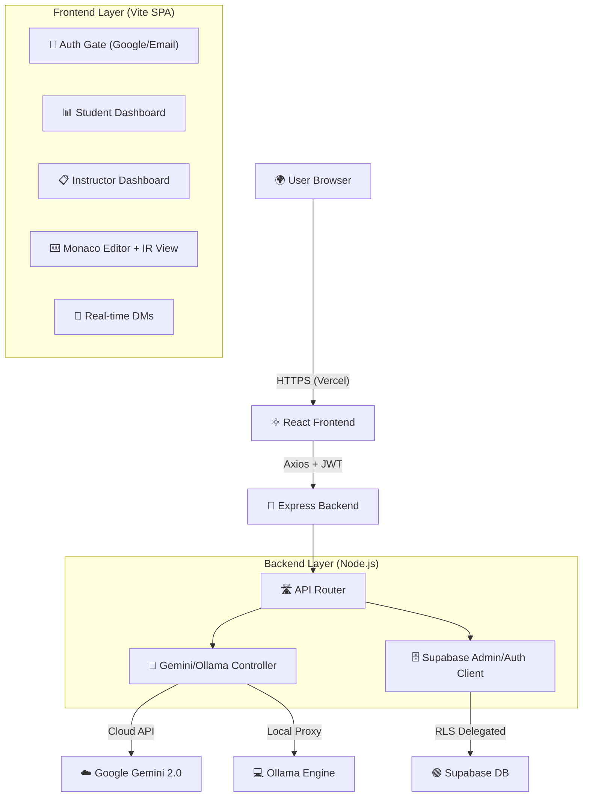

# CodeIR: Advanced IR Visualization & Evaluation Platform

[](https://codeir.vercel.app)
[](https://code-ir-backend.vercel.app/)
[](https://supabase.com)
[](https://deepmind.google/technologies/gemini/)

## Overview

**CodeIR** is a state-of-the-art educational platform designed to bridge the conceptual gap between high-level source code and compiler Intermediate Representations (IR). Developed for both students and instructors, CodeIR provides a high-fidelity environment for code submission, AI-powered logic extraction, and granular per-line assessment.

The platform utilizes a **Hybrid AI Strategy** (Cloud Gemini 2.0 + Local Ollama) and a **Serverless-Relational DB Backbone** to deliver real-time feedback and long-term learning analytics.

---

## 🏗️ System Architecture

CodeIR follows a **Security-First API Gateway Architecture**. The frontend communicates exclusively with a Node.js/Express backend that acts as a secure controller for AI engines and Supabase data orchestration.


```mermaid
graph TD
    User["🌍 User Browser"] -->|"HTTPS (Vercel)"| FE["⚛️ React Frontend"]

    subgraph "Frontend Layer (Vite SPA)"
        Auth["🔐 Auth Gate (Google/Email)"]
        S_Dash["📊 Student Dashboard"]
        I_Dash["📋 Instructor Dashboard"]
        Editor["⌨️ Monaco Editor + IR View"]
        Chat["💬 Real-time DMs"]
    end

    FE -->|"Axios + JWT"| BE["🚀 Express Backend"]

    subgraph "Backend Layer (Node.js)"
        Router["🛣️ API Router"]
        AI_Eng["🧠 Gemini/Ollama Controller"]
        DB_Eng["🗄️ Supabase Admin/Auth Client"]
    end

    BE --> Router
    Router --> AI_Eng
    Router --> DB_Eng

    AI_Eng -->|"Cloud API"| Gemini["☁️ Google Gemini 2.0"]
    AI_Eng -->|"Local Proxy"| Ollama["💻 Ollama Engine"]
    DB_Eng -->|"RLS Delegated"| SB["🟢 Supabase DB"]
```

### Key Technical Pillars

1.  **Monaco Editor Integration**: Provides a full VS Code-like experience with syntax highlighting and IntelliSense for multiple languages.
2.  **Dual AI Evaluation Pipeline**:
    *   **Google Gemini 2.0 Flash**: High-performance cloud inference for complex IR generation and multi-language translation.
    *   **Local Ollama**: Privacy-focused, offline-capable inference using models like `qwen2.5-coder:7b`.
3.  **Automatic Account Linking**: When a user logs in via **Google** with an email already registered via Email/Password, CodeIR automatically merges the identities into a single unified profile.
4.  **Smart Role Assignment**: Fresh users joining via OAuth (Social Login) are automatically assigned the **'student'** role and have their profile metadata initialized in Supabase instantly.
5.  **Dynamic RLS Proxying**: The backend uses user JWTs to perform database operations, ensuring PostgreSQL **Row Level Security** is always enforced, while the Admin Client handles system-level orchestration.

---

## ✨ Features

### 🎓 For Students
*   **Intelligent Workspace**: Code editor with real-time AI checking, IR visualization, and automated translations (Python/Java/C++).
*   **Performance Analytics**: A LeetCode-style dashboard featuring a **Contribution Heatmap**, submission stats, and average scoring.
*   **Rank Progression**: Level up from *Novice* to *Expert* as you solve more problems correctly.
*   **Direct Feedback**: View per-line code reviews from instructors directly in your editor.

### 🍎 For Instructors
*   **Submission Command Center**: Aggregated view of all student submissions with status badges and performance metrics.
*   **Granular Code Review**: Per-line comment system (Error/Warning/Suggestion/Praise) allowing deep intervention in student logic.
*   **Rubric-Based Grading**: Standardized evaluation across correctness, efficiency, and style.
*   **Problem Bank CRUD**: Full control over the platform's curriculum, including boilerplate code and difficulty settings.

### ☁️ Shared Features
*   **Real-Time DMs**: Integrated chat widget for instant teacher-student communication.
*   **Theme Engine**: System-synced Dark/Light mode persisted across devices in user metadata.
*   **Testimonials**: Performance-gated feedback system where top students can share their experience on the landing page.

---

## 🔌 API Documentation

### 🏥 System Health
*   `GET /api/health`: Comprehensive backend health check. Returns status "ok".

### 🏷️ Public Data (Landing Page)
*   `GET /api/public/stats`: Aggregated platform stats (Total Solved, active users, etc.).
*   `GET /api/public/testimonials`: List of approved student success stories.

### 👤 User Profiles & Skills
*   `GET /api/profiles/:userId`: Fetch metadata (display_name, bio, theme, avatar).
*   `PUT /api/profiles/:userId`: Update profile configuration.
*   `GET /api/profiles/:userId/skills`: Fetch student skill list.
*   `POST /api/profiles/:userId/skills`: Add a new skill badge.
*   `DELETE /api/skills/:skillId`: Remove a skill.

### 📝 Submissions & Drafts
*   `GET /api/dashboard/:userId`: Full student history (heatmaps + submissions).
*   `GET /api/drafts/:userId`: Fetch the latest unsubmitted draft for a user.
*   `POST /api/submissions`: Create a new validated submission or save a draft.
*   `GET /api/instructor/dashboard`: Overarching view of every student attempt.

### 🧠 AI & Evaluations
*   `POST /api/evaluate-code`: Direct access to the AI pipeline (Correctness/IR/Translation).
*   `POST /api/evaluations`: Submit a rubric-based instructor grade.
*   `GET /api/evaluations/:submissionId`: Get teacher feedback for a specific attempt.

---

## 🛠️ Installation & Production Setup

### 1. Prerequisites
*   Node.js (v18+) & NPM.
*   Supabase Project URL & Keys.
*   Google Generative AI API Key.
*   (Optional) Ollama running locally for offline features.

### 2. Environment Variables

**Frontend (`/.env`)**
```env
VITE_SUPABASE_URL=https://your-proj.supabase.co
VITE_SUPABASE_ANON_KEY=eyJhb...
```

**Backend (`/backend/.env`)**
```env
PORT=5000
SUPABASE_URL=https://your-proj.supabase.co
SUPABASE_SERVICE_ROLE_KEY=eyJhb...
GEMINI_API_KEY=AIzaSy...
```

### 3. Vercel Deployment Configuration

**Frontend Deployment**:
1. Connect GitHub repo to Vercel.
2. Set Root Directory to `./` (base of repo).
3. Add `VITE_SUPABASE_URL` and `VITE_SUPABASE_ANON_KEY` to Vercel Env Vars.
4. **Important**: Set `VITE_API_URL` to your Vercel Backend URL (example: `https://code-ir-backend.vercel.app`).

**Backend Deployment**:
1. Create a separate Vercel project for the `backend/` folder.
2. Set Root Directory to `backend/`.
3. Add all `backend/.env` variables to Vercel.
4. Set **Serverless Function Timeout** to 60s (to allow AI to process).

---

## 🔒 Security Configuration

### Supabase Settings
1.  **Authentication -> Providers -> Email**: Disable "Confirm Email" for faster user onboarding (optional).
2.  **Authentication -> Providers -> Google**: Enable and provide Client ID/Secret from Google Cloud.
3.  **Authentication -> URL Configuration**:
    *   **Site URL**: `https://codeir.vercel.app`
    *   **Redirect URLs**: `https://codeir.vercel.app/**`
4.  **Identity Linking**: Check **"Link accounts with same email"** to allow seamless Google/Password account merging.

### RLS Policies
Ensure you apply the following logic to your `submissions` table:
```sql
-- Allow students to insert their own work
CREATE POLICY "Users can insert their own submissions" ON submissions 
FOR INSERT TO authenticated 
WITH CHECK (auth.uid() = user_id);

-- Allow instructors to view all student attempts
-- (Handled via Admin Client in backend for dashboard visualization)
```

---

## 📂 Project Structure

```text
codeir-spd/
├── backend/                  # Node.js/Express API Gateway
│   ├── index.js              # Server entry & high-level routing
│   ├── routes/               # Modularized API endpoints
│   ├── controllers/          # Business logic & AI orchestration
│   └── middleware/           # Auth verification & Error handling
├── src/                      # React TypeScript Frontend
│   ├── components/           # UI Components (Auth, Dashboard, Editor)
│   ├── lib/                  # Client-side singletons (Supabase)
│   ├── assets/               # Brand & Static assets
│   └── App.tsx               # Global Router & Auth Guard
└── public/                   # Static browser assets
```

---

## 📜 License & Usage
**Academic Use License** | Developed by [OCTehckie18](https://github.com/OCTehckie18) & team.
This platform is intended for teaching compiler theory and advanced programming logic.

---
*Powered by Team CodeIR.*
