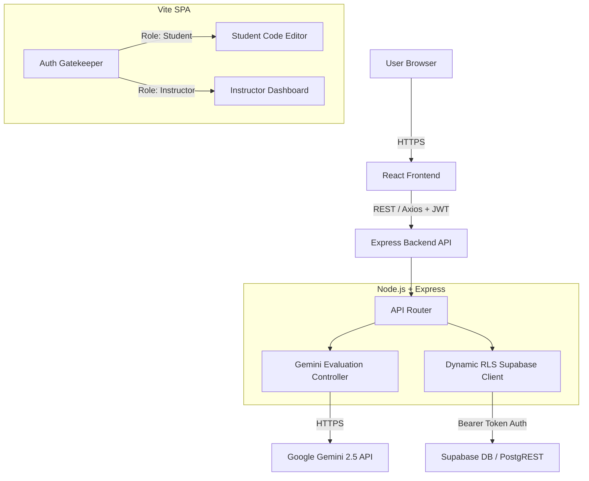

# CodeIR: Intermediate Representation Visualization Platform

## Overview

**CodeIR** is a full-stack educational web application designed to bridge the gap between high-level source code and compiler Intermediate Representations (IR). It features a sophisticated dual-role architecture (Student/Instructor) enabling real-time code submission, AI-powered code evaluation, IR visualization, and rubric-based assessment.

The system leverages a **Serverless Database Architecture** via Supabase alongside a **Dual AI Engine Architecture** (Google Gemini 2.5 Flash for cloud, and Ollama for secure local CPU inference). It strictly employs typed **TypeScript** interfaces on the frontend to ensure type safety across the full stack while utilizing delegated Row Level Security (RLS) for comprehensive data protection.

---

## System Architecture

The application operates on a **Full-Stack API Gateway Architecture**. The React frontend communicates strictly with a Node.js/Express backend, which securely manages interactions with Supabase and Google's Generative AI API.


```mermaid
graph TD
    User[User Browser] -->|HTTPS| React[React Frontend]
    
    subgraph Frontend [Vite SPA]
        Auth[Auth Gatekeeper]
        Auth -->|Role: Student| Editor[Student Code Editor]
        Auth -->|Role: Instructor| Eval[Instructor Dashboard]
    end

    React -->|REST / Axios + JWT| API[Express Backend API]

    subgraph Backend [Node.js + Express]
        Router[API Router]
        EvalController[Gemini Evaluation Controller]
        DBController[Dynamic RLS Supabase Client]
    end

    API --> Router
    Router --> EvalController
    Router --> DBController

    EvalController -->|HTTPS| Gemini[Google Gemini 2.5 API]
    DBController -->|Bearer Token Auth| SB[Supabase DB / PostgREST]
```

### Key Technical Decisions

1. **Monaco Editor Integration:** Utilizes `@monaco-editor/react` to provide VS Code-level editing capabilities (IntelliSense, syntax highlighting) directly in the browser.
2. **Dedicated Node.js Backend:** Centralizes API logic, protecting the Gemini AI Evaluation pipeline and enforcing sequential relational database updates without exposing sensitive Supabase credentials to the client.
3. **Dual AI Evaluation Pipeline (Gemini/Ollama):** Integrates with `@google/generative-ai` (Gemini 2.5 Flash) and local `Ollama` models (e.g. `gpt-oss:latest`) via the backend API to evaluate code correctness, dynamically generate pseudocode (IR), and provide live code translations (Python, Java, C++). The AI engine is selectively cached via UI Toggles.
4. **Dynamic RLS Database Routing:** The backend operates as a dynamic proxy, catching the JWT `access_token` from the frontend to instantiate specialized Supabase clients per request. This ensures all Database CRUD natively obeys Postgres Row-Level Security checks at the server level.
5. **Tailwind CSS v4:** Adopts the latest CSS-first configuration approach for high-performance atomic styling, utilizing `dvh` units for robust mobile responsiveness.
6. **Relational Data Mapping:** Shifts from flat tables to a highly normalized PostgreSQL structure (`problems`, `submissions`, `pseudocodes`, `evaluations`) with strict foreign keys to preserve learning traces and auditability.

---

## Tech Stack

### Frontend Core

- **Framework:** React 18 (Functional Components, Hooks)
- **Language:** TypeScript (Strict Mode)
- **Build Tool:** Vite (ESBuild based)
- **Styling:** Tailwind CSS v4, Lucide React (Iconography)

### Editor & Visualization

- **Editor Engine:** Monaco Editor (VS Code core)
- **State Management:** React Context API + Local State (optimized to prevent prop drilling)

### Backend & API Middleware

- **Runtime:** Node.js
- **Server Framework:** Express.js
- **Middleware:** CORS, dotenv
- **Client Networking:** Axios (Frontend to Backend)

### Database Layer (BaaS)

- **Platform:** Supabase
- **Database:** PostgreSQL 15+
- **Auth:** Supabase Auth (JWT via Frontend)
- **Data Access:** Dynamic Auth Delegation via Backend request headers

### AI & Evaluation Engine

- **LLM Manager:** Google Gemini 2.5 Flash (Cloud API) & Local Ollama Engine (`gpt-oss:latest`)
- **Features:** Toggleable AI engine evaluation, Code correctness validation, high-level IR generation, and cross-language translation mappings.

---

## Relational Database Schema

The data layer has been restructured into a highly normalized relational model with strict Foreign Key constraints and sequential dependency requirements.

### 1. `public.users` (Profile Mapping)
Maps directly to `auth.users` to track roles and system usage.
- `user_id` (UUID, PK) -> Links to `auth.users(id)`
- `role` (Text) -> 'student' | 'teacher'
- `daily_attempt_limit` (Int)

### 2. `public.problems`
The unit of practice.
- `problem_id` (UUID, PK)
- `problem_statement` (Text)
- `constraints` (Text)
- `difficulty_level` (Text)

### 3. `public.submissions`
Append-only history of student attempts.
- `submission_id` (UUID, PK)
- `user_id` (UUID, FK -> users)
- `problem_id` (UUID, FK -> problems)
- `source_language` (Text)
- `source_code` (Text)
- `validation_status` (Text Check: 'pending', 'invalid', 'valid')
- `submission_timestamp` (Timestamptz)

### 4. `public.pseudocodes`
Strict 1-to-1 relationship mapping IR to a valid submission.
- `pseudocode_id` (UUID, PK)
- `submission_id` (UUID, UNIQUE FK -> submissions)
- `structured_blocks` (JSONB)
- `locked_status` (Boolean)

### 5. `public.translations`
Maps the target languages generated from a valid pseudocode block.
- `translation_id` (UUID, PK)
- `pseudocode_id` (UUID, FK -> pseudocodes)
- `target_language` (Text)
- `translated_code` (Text)

### 6. `public.rubrics` & `public.evaluations`
Tracks the teacher grading process against the submissions.
- `evaluations.evaluation_id` (UUID, PK)
- `evaluations.submission_id` (UUID, FK -> submissions)
- `evaluations.rubric_id` (UUID, FK -> rubrics)
- `evaluations.final_scores` (JSONB)
- `evaluations.teacher_feedback` (Text)

---

## Security & RLS Policies

Security is enforced natively at the Postgres level. The Express Engine maps all incoming frontend requests to dynamic tokens.

**1. Submission Isolation:**

```sql
CREATE POLICY "Users can see own submissions"
ON submissions FOR SELECT
USING (auth.uid() = user_id);
```

**2. Data Integrity:**

- `ON DELETE CASCADE` is implemented on `submissions`. If a user is deleted, their code attempts vanish.
- `ON DELETE CASCADE` is implemented on `evaluations`. If a submission is deleted, its grade vanishes.

---

## Project Structure

```text
codeir/
├── backend/                # Node.js/Express Middleware Gatekeeper
│   ├── index.js            # Express API Entrypoint
│   ├── .env                # Gemini API & Supabase Configuration
│   └── package.json        
├── src/                    # Frontend React SPA
│   ├── assets/             # Static assets
│   ├── components/
│   │   ├── AuthForm.tsx    # Login/Signup Logic
│   │   ├── CodeEditor.tsx  # Dynamic Code Entry, Gemini Targeting & Safeties
│   │   ├── StudentDashboard.tsx # Relational Submissions & Analytics Heatmap
│   │   ├── InstructorDashboard.tsx # Active Student Evaluation Overviews
│   │   └── InstructorEvaluation.tsx # Rubric-based Grading Editor
│   ├── lib/
│   │   └── supabaseClient.ts # Singleton Supabase Client (Frontend Auth)
│   ├── App.tsx             # Main Router / Role-based Gatekeeper
│   ├── index.css           # Tailwind v4 Imports & Base styles
│   └── main.tsx            # Entry Point
├── package.json            # Frontend Dependencies
└── vite.config.ts          # Vite Configuration
```

---

## Installation & Setup

### Prerequisites

- Node.js v16+
- npm or yarn
- A Supabase Project
- Google Gemini API Key

### Step 1: Clone & Install

```bash
git clone https://github.com/your-username/codeir.git
cd codeir
npm install
```

### Step 2: Environment Configuration

Create a `.env` file in the root frontend directory:

```env
VITE_SUPABASE_URL=your_supabase_project_url
VITE_SUPABASE_ANON_KEY=your_supabase_anon_key
```

Create a `.env` file in the `/backend` directory:

```env
PORT=5000
SUPABASE_URL=your_supabase_project_url
SUPABASE_SERVICE_ROLE_KEY=your_supabase_service_key
GEMINI_API_KEY=your_google_gemini_key
```

### Step 3: Start the Backend Server

```bash
cd backend
npm install
node index.js
```

### Step 4: Run Development Server (Frontend)

```bash
cd ..
npm run dev
```

---

## Features Breakdown

### Role-Based Access Control (RBAC)

The application determines the UI to render based on user metadata:

- **Student:** Accesses `CodeEditor.tsx`. Can write code, dynamically check syntax status, validate logic using Gemini, manage LLM states via "Cancel Validation", view generated IR / language translations, and safely persist progress to the DB.
- **Instructor:** Accesses `InstructorEvaluation.tsx`. Can view student code, pull live IR representations, and lock in rubric scores/feedback over a secure authenticated connection.

### AI-Powered Code Validation Pipeline

- **Correctness Check:** The student's source code and problem description are forwarded to either `Gemini` or `Ollama` (based on dashboard state) to be validated.
- **Dynamic State Safety:** If code is deemed `invalid` or `pending`, the Code Save button adapts gracefully, blocking saving until the user hits a `valid` state or triggers a manual Cancel Reset.
- **Dynamic IR Generation:** Once validated as `CORRECT`, the code is parsed into structured pseudocode.
- **Language Translation:** Code is simultaneously translated into Python, Java, and C++ for comparative learning.

### Offline Manual Evaluation

If the Instructor view accesses the evaluation dashboard without a specific student submission (from scratch), the system gracefully enters **Manual Evaluation Mode** (formerly Sandbox Mode).

- **Behavior:** The editor is fully writable and functional for manual testing.
- **Ghost Submissions:** Saving is fully enabled. The backend intercepts the lack of a submission ID, natively authors an offline "Instructor Offline Evaluation" ghost-submission, and securely anchors the rubric grades dynamically back to the database.

---

## License

**Academic Use Only** | CodeIR Architecture Team
