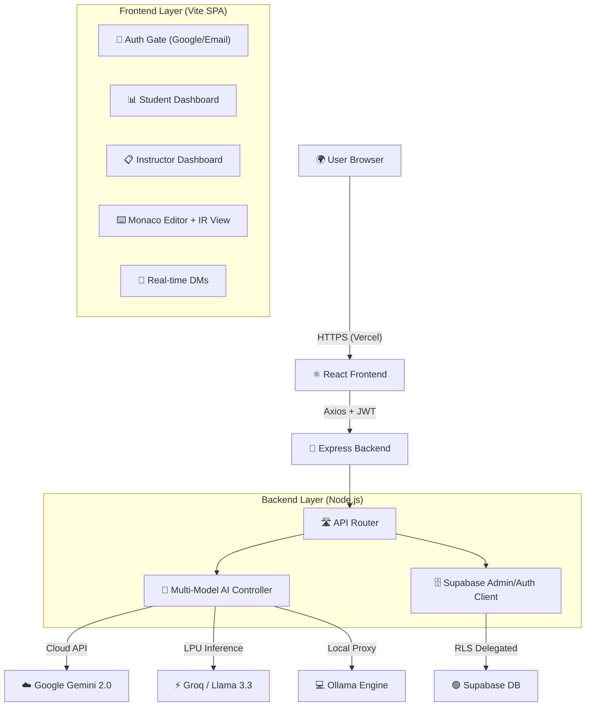

# CodeIR: The Ultimate AI-Powered Code Evaluation Platform

[](https://codeir.vercel.app)
[](https://code-ir-backend.vercel.app/)
[](https://supabase.com)
[](https://codeir.vercel.app)

**CodeIR** is a state-of-the-art, production-ready educational platform designed to bridge the conceptual gap between source code and compiler Intermediate Representations (IR). Developed for both students and instructors, CodeIR provides a high-fidelity environment for code submission, AI-powered logic extraction, and granular per-line assessment.

The platform utilizes a **Triple-Engine AI Strategy** (Cloud Gemini 2.0, Lightning-Fast Groq, and Local Ollama) to deliver unprecedented evaluation depth and performance.

---

## 🏗️ System Architecture

CodeIR follows a **Security-First API Gateway Architecture**. The frontend communicates exclusively with a Node.js/Express backend that acts as a secure controller for AI engines and Supabase data orchestration.


```mermaid
graph TD
    User["🌍 User Browser"] -->|"HTTPS (Vercel)"| FE["⚛️ React Frontend"]

    subgraph "Frontend Layer (Vite SPA)"
        Auth["🔐 Auth Gate (Google/Email)"]
        S_Dash["📊 Student Dashboard"]
        I_Dash["📋 Instructor Dashboard"]
        Editor["⌨️ Monaco Editor + IR View"]
        Chat["💬 Real-time DMs"]
    end

    FE -->|"Axios + JWT"| BE["🚀 Express Backend"]

    subgraph "Backend Layer (Node.js)"
        Router["🛣️ API Router"]
        AI_Eng["🧠 Multi-Model AI Controller"]
        DB_Eng["🗄️ Supabase Admin/Auth Client"]
    end

    BE --> Router
    Router --> AI_Eng
    Router --> DB_Eng

    AI_Eng -->|"Cloud API"| Gemini["☁️ Google Gemini 2.0"]
    AI_Eng -->|"LPU Inference"| Groq["⚡ Groq / Llama 3.3"]
    AI_Eng -->|"Local Proxy"| Ollama["💻 Ollama Engine"]
    DB_Eng -->|"RLS Delegated"| SB["🟢 Supabase DB"]
```

### Key Technical Pillars

1.  **Monaco Editor Integration**: Provides a full VS Code-like experience with syntax highlighting and IntelliSense for multiple languages.
2.  **Triple AI Evaluation Pipeline**:
    *   **Google Gemini 2.0 Flash**: High-performance cloud inference for complex IR generation and multi-language translation.
    *   **Groq LPU**: Lightning-fast inference using Llama 3.3 models for near-instantaneous feedback.
    *   **Local Ollama**: Privacy-focused, offline-capable inference for environments with strict data controls.
3.  **Automatic Account Linking**: When a user logs in via **Google** with an email already registered via Email/Password, CodeIR automatically merges the identities into a single unified profile.
4.  **Smart Role Assignment**: Fresh users joining via OAuth (Social Login) are automatically assigned the **'student'** role and have their profile metadata initialized in Supabase instantly.
5.  **Dynamic RLS Proxying**: The backend uses user JWTs to perform database operations, ensuring PostgreSQL **Row Level Security** is always enforced.

---

## ✨ Features

### 🎓 For Students
*   **Intelligent Workspace**: Code editor with real-time AI checking, IR visualization, and automated translations (Python/Java/C++).
*   **Performance Analytics**: A LeetCode-style dashboard featuring a **Contribution Heatmap**, submission stats, and average scoring.
*   **Rank Progression**: Level up from *Novice* to *Expert* as you solve more problems correctly.
*   **Direct Feedback**: View per-line code reviews from instructors directly in your editor.

### 🍎 For Instructors
*   **Submission Command Center**: Aggregated view of all student submissions with status badges and performance metrics.
*   **Granular Code Review**: Per-line comment system (Error/Warning/Suggestion/Praise) allowing deep intervention in student logic.
*   **Rubric-Based Grading**: Standardized evaluation across correctness, efficiency, and style.
*   **Problem Bank CRUD**: Full control over the platform's curriculum, including boilerplate code and difficulty settings.

### ☁️ Shared Features
*   **Real-Time DMs**: Integrated chat widget for instant teacher-student communication.
*   **Theme Engine**: System-synced Dark/Light mode persisted across devices.
*   **Live Metrics**: Real-time platform statistics showing total evaluations and global averages.

---

## 🔌 API Documentation

### 🏥 System Health
*   `GET /api/health`: Comprehensive backend health check. Returns status "ok".

### 🏷️ Public Data (Landing Page)
*   `GET /api/public/stats`: Aggregated platform stats (Total Solved, active users, etc.).
*   `GET /api/public/testimonials`: List of approved student success stories.

### 👤 User Profiles & Skills
*   `GET /api/profiles/:userId`: Fetch metadata (display_name, bio, theme, avatar).
*   `PUT /api/profiles/:userId`: Update profile configuration.
*   `GET /api/profiles/:userId/skills`: Fetch student skill list.

### 📝 Submissions & Dashboards
*   `GET /api/dashboard/:userId`: Full student history (heatmaps + submissions).
*   `POST /api/submissions`: Create a new validated submission or save a draft.
*   `GET /api/instructor/dashboard`: Overarching view of every student attempt.

### 🧠 AI & Evaluations
*   `POST /api/evaluate-code`: Direct access to the AI pipeline (Correctness/IR/Translation).
*   `POST /api/evaluations`: Submit a rubric-based instructor grade.
*   `GET /api/evaluations/:submissionId`: Get teacher feedback for a specific attempt.

---

## 🛠️ Installation & Production Setup

### 1. Prerequisites
*   Node.js (v18+) & NPM.
*   Supabase Project URL & Keys.
*   AI API Keys (Gemini, Groq).

### 2. Environment Variables

**Frontend (`/.env`)**
```env
VITE_SUPABASE_URL=https://your-proj.supabase.co
VITE_SUPABASE_ANON_KEY=eyJhb...
VITE_API_URL=https://your-backend.vercel.app
```

**Backend (`/backend/.env`)**
```env
PORT=5000
SUPABASE_URL=https://your-proj.supabase.co
SUPABASE_SERVICE_ROLE_KEY=eyJhb...
GEMINI_API_KEY=AIzaSy...
GROQ_API_KEY=gsk_...
```

### 3. Vercel Deployment

**Frontend**:
1. Connect GitHub repo to Vercel.
2. Set Root Directory to `./`.
3. Add Envs: `VITE_SUPABASE_URL`, `VITE_SUPABASE_ANON_KEY`, `VITE_API_URL`.

**Backend**:
1. Create a separate Vercel project for the `backend/` folder.
2. Set Root Directory to `backend/`.
3. Add all `backend/.env` variables.
4. Set **Serverless Function Timeout** to 60s.

---

## 📜 License & Usage
**Academic Production Instance** | Developed by [OCTehckie18](https://github.com/OCTehckie18) & Team CodeIR.
This platform is intended for advanced computer science education and compiler theory study.

---
*Powered by Team CodeIR. Project officially LIVE.*
