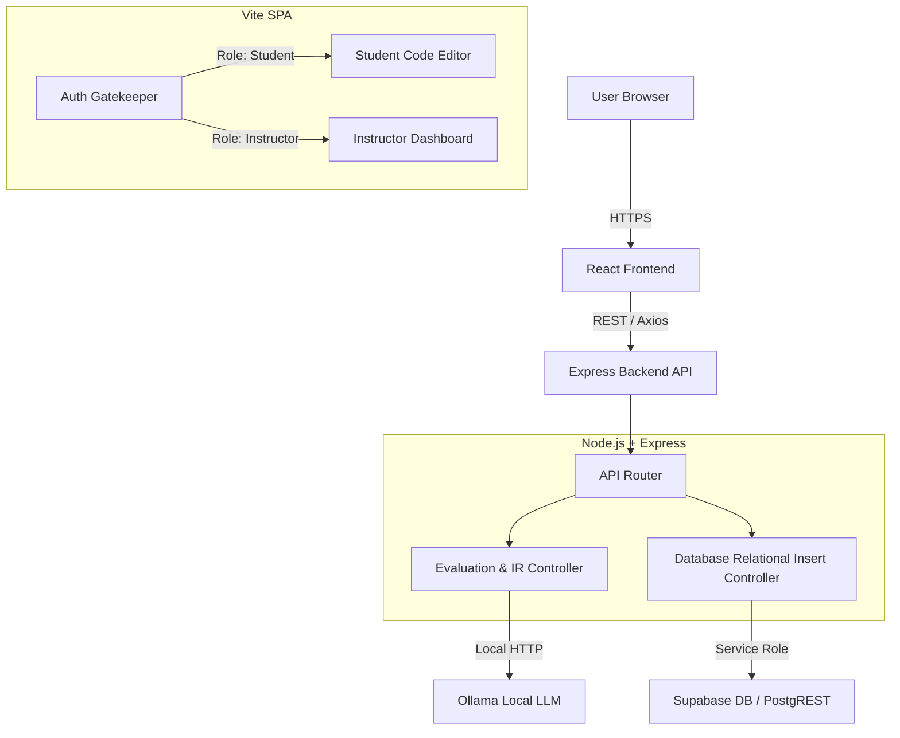

# CodeIR: Intermediate Representation Visualization Platform

## Overview

**CodeIR** is a full-stack educational web application designed to bridge the gap between high-level source code and compiler Intermediate Representations (IR). It features a sophisticated dual-role architecture (Student/Instructor) enabling real-time code submission, AI-powered code evaluation, IR visualization, and rubric-based assessment.

The system leverages a **Serverless Architecture** via Supabase alongside a **Local LLM integration (Ollama)**, employing strictly typed **TypeScript** interfaces on the frontend to ensure type safety across the full stack.

---

## System Architecture

The application is transitioning to a **Full-Stack API Gateway Architecture**. The React frontend communicates strictly with a Node.js/Express backend, which securely manages interactions with Supabase and the Ollama LLM.


```mermaid
graph TD
    User[User Browser] -->|HTTPS| React[React Frontend]
    
    subgraph Frontend [Vite SPA]
        Auth[Auth Gatekeeper]
        Auth -->|Role: Student| Editor[Student Code Editor]
        Auth -->|Role: Instructor| Eval[Instructor Dashboard]
    end

    React -->|REST / Axios| API[Express Backend API]

    subgraph Backend [Node.js + Express]
        Router[API Router]
        EvalController[Evaluation & IR Controller]
        DBController[Database Relational Insert Controller]
    end

    API --> Router
    Router --> EvalController
    Router --> DBController

    EvalController -->|Local HTTP| Ollama[Ollama Local LLM]
    DBController -->|Service Role| SB[Supabase DB / PostgREST]
```

### Key Technical Decisions

1. **Monaco Editor Integration:** Utilizes `@monaco-editor/react` to provide VS Code-level editing capabilities (IntelliSense, syntax highlighting) directly in the browser.
2. **Dedicated Node.js Backend:** Centralizes API logic, protecting the local AI Evaluation pipeline and enforcing sequential relational database updates without exposing sensitive Supabase credentials to the client.
3. **Local AI Evaluation Pipeline:** Integrates with Ollama (via backend) to run a local LLM for evaluating code correctness, generating pseudocode (IR), and providing live translations to multiple programming languages (Python, Java, C++).
4. **Tailwind CSS v4:** Adopts the latest CSS-first configuration approach for high-performance atomic styling, utilizing `dvh` units for robust mobile responsiveness.
5. **Relational Data Mapping:** Shifts from flat tables to a highly normalized PostgreSQL structure (`problems`, `submissions`, `pseudocodes`, `evaluations`) with strict foreign keys to preserve learning traces and auditability.

---

## Tech Stack

### Frontend Core

- **Framework:** React 18 (Functional Components, Hooks)
- **Language:** TypeScript (Strict Mode)
- **Build Tool:** Vite (ESBuild based)
- **Styling:** Tailwind CSS v4, Lucide React (Iconography)

### Editor & Visualization

- **Editor Engine:** Monaco Editor (VS Code core)
- **State Management:** React Context API + Local State (optimized to prevent prop drilling)

### Backend & API Middleware

- **Runtime:** Node.js
- **Server Framework:** Express.js
- **Middleware:** CORS, dotenv
- **Client Networking:** Axios (Frontend to Backend)

### Database Layer (BaaS)

- **Platform:** Supabase
- **Database:** PostgreSQL 15+
- **Auth:** Supabase Auth (JWT via Frontend)
- **Data Access:** Supabase Service Role Key (via Backend)

### AI & Evaluation Engine

- **Local LLM Manager:** Ollama (gpt-oss model)
- **Features:** Code correctness validation, high-level IR generation, and cross-language translation.

---

## Relational Database Schema

The data layer has been restructured into a highly normalized relational model with strict Foreign Key constraints and sequential dependency requirements.

### 1. `public.users` (Profile Mapping)
Maps directly to `auth.users` to track roles and system usage.
- `user_id` (UUID, PK) -> Links to `auth.users(id)`
- `role` (Text) -> 'student' | 'teacher'
- `daily_attempt_limit` (Int)

### 2. `public.problems`
The unit of practice.
- `problem_id` (UUID, PK)
- `problem_statement` (Text)
- `constraints` (Text)
- `difficulty_level` (Text)

### 3. `public.submissions`
Append-only history of student attempts.
- `submission_id` (UUID, PK)
- `user_id` (UUID, FK -> users)
- `problem_id` (UUID, FK -> problems)
- `source_language` (Text)
- `source_code` (Text)
- `validation_status` (Text Check: 'pending', 'invalid', 'valid')
- `submission_timestamp` (Timestamptz)

### 4. `public.pseudocodes`
Strict 1-to-1 relationship mapping IR to a valid submission.
- `pseudocode_id` (UUID, PK)
- `submission_id` (UUID, UNIQUE FK -> submissions)
- `structured_blocks` (JSONB)
- `locked_status` (Boolean)

### 5. `public.translations`
Maps the target languages generated from a valid pseudocode block.
- `translation_id` (UUID, PK)
- `pseudocode_id` (UUID, FK -> pseudocodes)
- `target_language` (Text)
- `translated_code` (Text)

### 6. `public.rubrics` & `public.evaluations`
Tracks the teacher grading process against the submissions.
- `evaluations.evaluation_id` (UUID, PK)
- `evaluations.submission_id` (UUID, FK -> submissions)
- `evaluations.rubric_id` (UUID, FK -> rubrics)
- `evaluations.final_scores` (JSONB)
- `evaluations.teacher_feedback` (Text)

---

## Security & RLS Policies

Security is enforced at the Postgres level.

**1. Submission Isolation:**

```sql
CREATE POLICY "Users can see own submissions"
ON submissions FOR SELECT
USING (auth.uid() = user_id);

```

**2. Data Integrity:**

- `ON DELETE CASCADE` is implemented on `submissions`. If a user is deleted, their code attempts vanish.
- `ON DELETE CASCADE` is implemented on `evaluations`. If a submission is deleted, its grade vanishes.

---

## Project Structure

## Project Structure

```text
codeir/
├── backend/                # Phase 1 initialized Node.js Backend
│   ├── index.js            # Express API Entrypoint
│   ├── .env                # Supabase Service Role Configuration
│   └── package.json        
├── src/                    # Frontend React SPA
│   ├── assets/             # Static assets
│   ├── components/
│   │   ├── AuthForm.tsx    # Login/Signup Logic
│   │   ├── CodeEditor.tsx  # Dynamic Code Entry & Target Translation
│   │   ├── StudentDashboard.tsx # Relational Submissions & Analytics Heatmap
│   │   ├── InstructorDashboard.tsx # Active Student Evaluation Overviews
│   │   └── InstructorEvaluation.tsx # Rubric-based Grading Editor
│   ├── lib/
│   │   └── supabaseClient.ts # Singleton Supabase Client (Frontend Auth)
│   ├── App.tsx             # Main Router / Gatekeeper
│   ├── index.css           # Tailwind v4 Imports & Base styles
│   └── main.tsx            # Entry Point
├── package.json            # Frontend Dependencies (Axios, Monaco, React)
└── vite.config.ts          # Vite Configuration

```

---

## Installation & Setup

### Prerequisites

- Node.js v16+
- npm or yarn
- A Supabase Project

### Step 1: Clone & Install

```bash
git clone [https://github.com/your-username/codeir.git](https://github.com/your-username/codeir.git)
cd codeir
npm install

```

### Step 2: Environment Configuration

Create a `.env` file in the root directory:

```env
VITE_SUPABASE_URL=your_supabase_project_url
VITE_SUPABASE_ANON_KEY=your_supabase_anon_key

```

### Step 3: Start the Backend server

```bash
cd backend
npm install
npm run dev
```

### Step 4: Run Development Server (Frontend)

```bash
cd ..
npm run dev
```

---

## Features Breakdown

### Role-Based Access Control (RBAC)

The application determines the UI to render based on user metadata:

- **Student:** Accesses `CodeEditor.tsx`. Can write code, validate logic using the local AI evaluator, view generated IR / language translations, and submit.
- **Instructor:** Accesses `InstructorEvaluation.tsx`. Can view student code (read-only/writeable depending on mode), view IR, and input rubric scores/feedback.

### AI-Powered Code Validation Pipeline

- **Correctness Check:** The student's source code and problem description are sent to a local LLM to be validated.
- **Dynamic IR Generation:** Once validated as correct, the code is parsed into structured pseudocode.
- **Language Translation:** Code is simultaneously translated into Python, Java, and C++ for comparative learning.

### Sandbox Mode

If the Instructor view is loaded without a database connection or valid student submission, the system gracefully degrades into **Sandbox Mode**.

- **Behavior:** The editor becomes writable for manual testing.
- **Visual Cue:** A yellow "Sandbox Mode" badge appears in the header.
- **Submission:** Saving is disabled/mocked to prevent foreign key constraint violations.

---

## License

**Academic Use Only** | CodeIR Architecture Team
